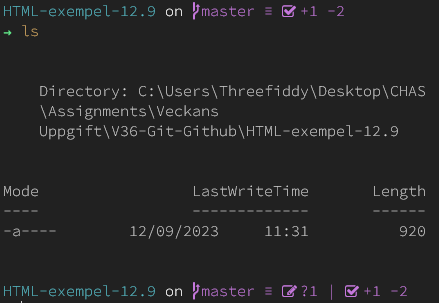
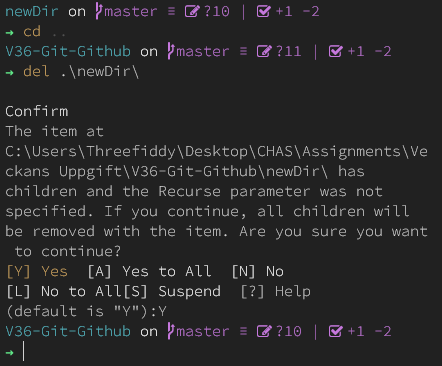
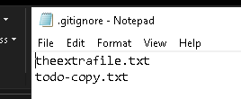
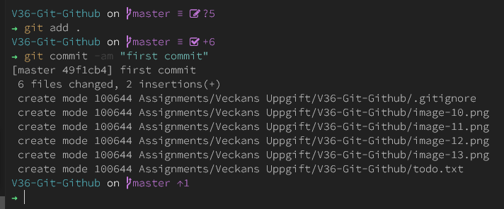
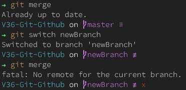

### 1. Write the command to change the terminal directory to the example directory.

### 2. Check the contents of the directory with a terminal command. Write the command and what files and directories are inside the example directory.

### 3. Copy and rename the “todo.txt” as “todo-copy.txt” to the project directory with a terminal command.

    Not found...

### 4. Now move the original “todo.txt” file to the project directory using a terminal command. Write the terminal commands.

### 5. Now move to the project directory and check it’s contents with terminal commands. Write commands and the contents.

### 6. Make a new directory named “newDir” inside the project directory and move to it with terminal commands. Write the terminal commands.

### 7. Create two new text files named “newText1” and “newText2” inside “newDir” directory.

### 8. Now delete “newText2” file from the “newDir” directory.

### 9. Move back one directory and delete the “newDir” directory while the “newText1” file isinside it.

### 1. Initialize Git in the project directory. Write the command.

    git init

### 2. Sometimes we don’t want Git to track every file in our directory and for that we use a gitignore file. Create file named “.gitignore” (file is just .gitignore without anything added) with a terminal command and with a text editor (E.g. Notepad, you don’t have to use a terminal command for this) add “theextrafile.txt” and “todo-copy.txt” as separate lines into this file.

### 3. Add the “todo.txt” file to Git. Write the command.

### 4. Check that Git added the “todo.txt” using Git command. Write the command.

### 5. Commit the added “todo.txt” file with the commit message ‘first commit’. Write the command.

### 6. Now add “7. Practice code.” as a new line to the “todo.txt” with some text editor (E.g. Notepad, you don’t have to use a terminal command for this). Then check the file with “git status” and write the state that the “todo.txt” file is in. 3

### 7. Add and commit these changes with the message ‘added new task’. Write the commands.

### 8. Create a new branch named “newBranch”. Write the command.

### 9. Now in this branch edit the “todo.txt” by adding “8. Complete internship task.”, “9.Practice chess openings.”, “10. Solve chess puzzles.” and “11. Check exam schedule.”as new lines. After adding add and commit these edits with the message ‘Added new tasks’. Write the commands.

### 10. Move back to the master branch and open the “todo.txt” with some text editor (E.g. Notepad, you don’t have to use a terminal command for this). Write the command and the last line from the todo list.

### 11. Now merge the “newBranch” into the master branch. Write the command.

### 12. Delete the “newBranch” now that it’s edits are merged to the master branch. Write thecommand. 4 GitHub Lastly let’s practice how to add and clone Git repositories with GitHub.

### 1. First create a new GitHub repository named Git-tutorial.

For the next three tasks you can get help from the page that you are redirected after creating
the GitHub repository. If you don’t remember or know the commands for the next tasks
you can refer to the section “…or push an existing repository from the command line” in the
GitHub page.

### 2. Set up your new GitHub repository as your remote repository in Git. Write the

command.

### 3. Rename your local Git repository as “main” so that it matches the GitHub naming

convention. Write the command.

### 4. Push your local Git repository to the remote GitHub repository. Write the command.

### 5. Change the directory to the example directory and clone your remote repository from

GitHub. Write the commands.
5
