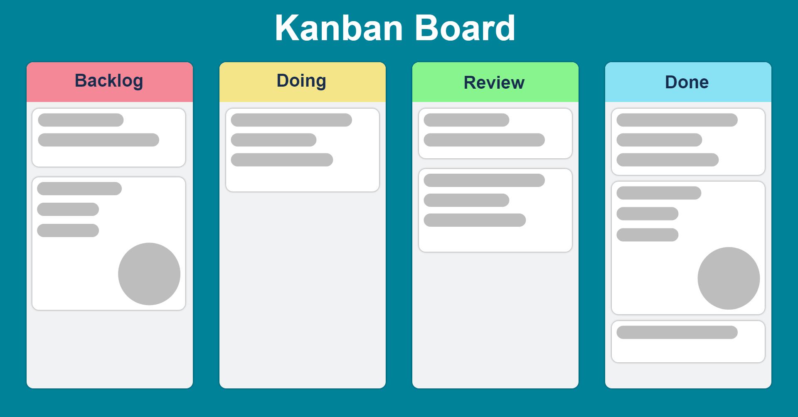
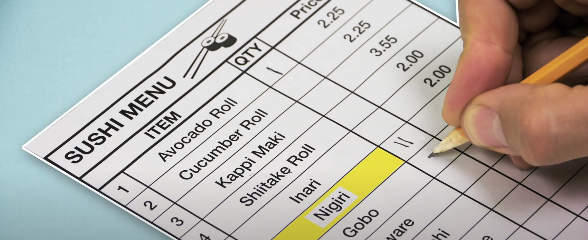

# Teorihandboken - Programmeringsmetodik (PG)

Studerande: Dennis Jensen

## PG 1.1 Versionshantering (Git)

    Versionshantering, ett så kallat VCS eller Version Control System är ett system som spårar och håller koll på lokala filer och mappar och sparar dom i ett "repository". Ett repository är där en användare sparar en kopia av sitt arbete, det finns många fördelar med att använda sig av ett VCS och spara sina projekt i ett repo.
    Först och främst så förenklar det arbete med projekt som har flera författare, dvs projekt som korrigeras och redigeras av fler än en person. En eller flera kan göra ändringar i ett projekt och spara det i slutet av dagen utan att det blir konflikt i vilken ändring som ska sparas, eftersom ett VCS kan se hur många som jobbar på ett projekt samt vilken användare som gjort vilka ändringar skapar det en möjlighet för flera att jobba samtidigt med olika delar av projektet.
    Om det skulle uppstå ett problem, en bugg eller om en fil skulle bli corrupt så kan man med hjälp av ett VCS lätt bläddra genom historiken och återställa projektet vid en tidigare punk.

    Ett VCS används inte bara för kodbas utan kan användas för att lagra information och dokumentation, design och projekt. Det som gör det unikt och värdefullt är användningen i sammarbete med andra människor. Programmerare använder till stor del Git och GitHub för att sammarbeta med sina kollegor och konsulter. Detta gör som genom att "brancha". Att Brancha betyder att man skapar en förgrening från projektet som man kan jobba fritt på utan att det påverkar huvudprojektet. Det är först vid "merge" det du skapat i din branch påverkar det faktiska projektet. Det gör det lätt och riskfritt att jobba på nya och flera förändringar i ditt projekt samtidigt.

När en utvecklare jobbar i ett VCS finns det tre stg dess arbete kan befinna sig i; - Working Tree
Är en egen checkout av en version av projektet. Dessa filer är hämtade ifrån databasen och sparade på den lokala disken. - Staging Area
Är en fil vars syfte är att hålla koll på vad som händer i "Working Tree", den noterar ändringar och markerar ändringar i nästa steg inför att adderas och committas. - Git Repository
Är den plats där git lagrar metadata för projektet. Det är den viktigaaste delen av Git. Det är här vi "pullar" och "pushar" alla projekt. Det är dessutom här vi kan clona nya projekt som vi vill ta del av.

    Vid särskilda behov erbjuder ett VCS som .git möjligheten att använda tillägg som tillgodoser särskilda behov som kan finnas för projektet.

    Det finns två olka typer av VCS. Centralized och Distributed.
    Centralized VCS sparar data centralt och gör projektet tillgängligt för alla som har åtkost till databasen/centralen.
    En negativ aspekt med centralized VCS är att du och ditt team är helt och hållet beroende av att centralen är online och fungerande. Dvs att om databasen ligger nere av någon anledning kommer ingen åt det som är sparat på den centrala databasen vilket hindrar framsteg i projektet.
    Distributed VCS är när alla som jobbar på projektet laddar ner projektet  på sin lokala dator och arbetar med materialet lokalt för att sedan spara sina ändringar och skicka tillbaka en kopia på projektet till databasen i slutet av dagen.
    Git är ett exempel på en Distributed Version Control System och används av majoriteten av utvecklare idag.

- Source: Lektion "Git & GitHub"
- [What is version control snd why should i ALWAYS us it | 2022](https://www.youtube.com/watch?v=IeXhYROClZk)
- [What is git?](https://www.youtube.com/watch?v=2ReR1YJrNOM&pp=ygUXd2hhdCBpcyB2ZXJzaW9uIGNvbnRyb2w%3D)

## PG 1.2 Benchmarking

Beskriv rubriken här

## PG 1.3 Testdriven utveckling

Beskriv rubriken här

## PG 1.4 Deploy och staging

Beskriv rubriken här

## PG 1.5 Debugging

Beskriv rubriken här

## PG 1.6 Dokumentation

Beskriv rubriken här

## PG 1.7 Struktur av kod i projekt

Beskriv rubriken här

## PG 1.8 Automatisering av arbetsflöde

Beskriv rubriken här

## PG 1.9 Virtualisering av utvecklingsmiljö

Beskriv rubriken här

## PG 1.10 Bundeling-verktyg

Beskriv rubriken här

## PG 1.11 Terminalinterface

Terminalen är en textbaserat kommand-center för din dator.
Med hjälp av förprogrammerade kommandon kan du navigera hela din dator, skapa och ändra filer samt öppna dessa samt köra program.
Terminalen arbetar responsivt till användarens prompts.
