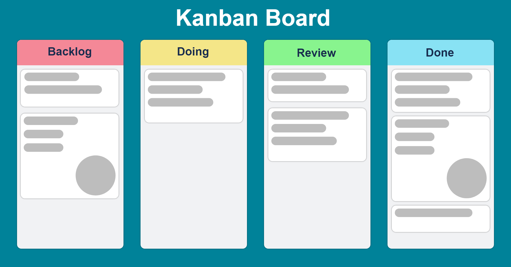

# Teorihandboken - Projektmetodik (PJ)

Studerande: **Dennis Jensen**

## PJ 1.1 Agila metoder (Scrum, Kanban, Extreme Programming)

### Agila metoder

Att arbeta agilt innebär att du jobbar strukturerat och med mycket input och feedback från kund och användare.
Det finns flera sätt att jobba agilt med systemutveckling, dock är principen densamma och jämförs med _waterfall_ som är ett annat sätt att jobba med projekt.

Till skillnad från _waterfall_ metoden så är agila arbetsmetoder **iterativa** samt adaptiv. Det betyder att resultatet och arbetet kan komma att ändras under projektets gång. Att jobba innebär mer frihet och mer ansvar över projektet samt mindre regler att följa, målet är att lansera en produkt som är användbar i slutändan och som möter kundens förväntan.
Fokus kommer i många fall att skifta under projektets gång och kommunikation med kunden är av högre värde än att hålla sig till det initiala kontraktet.

---

### Kanban

_Kanban_ är en agile arbetsmetod som betraktas som en del av _Lean Systemutveckling_. Grunden till _kanban_ kommer från den Japanska produktionsindustrin. Ett exempel på hur _kanban_ i största enkelhet fungerar är på sushimenyer i Japan.

_Kanban_ är uppbyggt i olika steg, där man etablerar _vad_, _hur_ och _när_ någonting ska ske för att effektivisera processen mellan start och mål. Hur det appliceras på systemutveckling är genom att man sätta upp _issues_ på en _kanban-board_.

I första spalten placerar man _issues_ och på varje kort finns en beskrivning om _vad_ som ska göras, _hur_ det ska göras och till _när_ denna issue förväntas vara löst.

För att effektivisera processen ännu mer finns det en _WIP_ limit (_Work In Progress_) som förhindrar teamet att ta på sig för mycket arbete på samma gång och uppmuntrar samarbete för att hålla ett jämt flöde från vänster till höger.

När _WIP_ gränsen är nådd går det inte att lägga till nya _issues_ i den spalten och gör att den som är _Produktansvarig_/_Scrum Master_ lägger om prioriteringsordningen för att attackera flaskhalsen som gör att flödet inte kan fortsätta.

---

### Scrum

**Scrum** är ett ramverk vars syfte är att strukturera upp arbetsflödet genom agile arbetsmetodik.

_Scrum_ som metod används ofta i kombination med _kanban_ för att skapa en effektiv och visuell arbetsmiljö för webbutvecklare. _Scrum_ som metodik sätter strukturen för hur man ska tackla en mängd arbetsuppgifter tillsammans för att skapa maximal vinst.

_Scrum_ består av tre roller:

1. **Produktägare**
2. **Scrum Master**
3. **Team**

---

#### Produktägare

Produktägaren är den som bestämmer över den ekonomiska biten i ett projekt för att säkerställa att resten av arbetslaget har en lön att plocka ut i slutet av månaden.

Produktägaren är den eller de personer som är ansvarig för projektet och ofta den person som kom med idén från första början. Det är produktägarens ansvar att se till att projektet går med vinst, levererar vad som utlovas och att projektet blir klart i tid.

Produktägaren får inte detaljstyra teamet, utan har befogenhet att säga vad som behöver prioriteras samt skapa nya _issues_ för teamet att lösa. Det finns en kommunikatör, ett skyddsnät och ett bollplank som Teamet och produktägaren har kontakt med var för sig. En så kallad Scrum Master.

---

#### Scrum Master

En Scrum Master är den som kommer sköta kommunikationen mellan de två andra rollerna. Scrum Mastern är Teamets coach och håller flera 'Cartonnier' under projektets gång. En ceremoni är kort sagt ett möte. Varje ceremoni har ett särskilt syfte. Här är tre ceremonier som ses som grundläggande för att kunna arbeta med Scrum inom systemutveckling.

1. Sprint Planning - En ceremoni vars syfte är att se över de funktioner som produktägaren vill sälja, skapa en prioriteringsordning samt sätta en siffra för hur krävande de kommer att vara att skapa.

2. Daily Standup - Ett dagligt möte som sker mellan Scrum Master och Teamet där de kan kommunicera vad som gjorts sedan förra mötet, vad som har gått bra samt mindre bra. Vid hinder så allokeras teamets timmar ut så att målet nås i slutet av sprinten.

3. Sprint Review & Sprint Retrospective - Under denna ceremoni visar teamet upp vad de jobbat på under sprinten, samt berättar vad som kan behöva justeras inför nästa sprint.

---

#### Team

Ett _team_ är en sammansättning av utvecklare, ux/ui designers, data engineers mm. och måste inte följa en viss formula för att fungera. Alla projekt är olika och _teamet_ som kan bestå av utvecklare, testare och ux designers kan dela uppgifter vid behov. Dvs att en testare kan programmera och en utvecklare kan testa.

---

#### Scrum Workflow

_Scrums_ workflow ser ut ungefär såhär och kallas för sprint.

_Backlog -> Sprint Backlog -> Sprint -> Daily Standup -> Sprint Review -> Sprint Retrospective_

Ett sprint motsvarar vanligtvis 1-3 veckor och börjar efter _Sprint backlog_.
Emellan Dessa utsatta ceremonier jobbar _teamet_ med _issues_ på nya features som testas och godkänns.

Ett exempel på hur dessa tre roller jobbar i relation till varandra och varför skulle kunna vara:

_Produktägaren_ får en idé som den vet att kunder kommer vara intresserade av och kommer betala för att få implementerad. Hen räknar ut vad de kan räkna med att betala för idén som färdig produkt och vänder sig till _Scrum Mastern_ och _Teamet_.

De nya idéerna formuleras på ett sätt så att förväntan hos _Produktägaren och teamet_ är desamma. Det görs genom en så kallad _User Storie_ som kommunicerar användarens förväntan och behov.
**'Som användare... behöver jag... så att... !**

Att formulera en ny idé eller förväntan på det här sättet ger teamet bättre förutsättningar att ge kunden vad de efterfrågat i slutändan.

Tillsammans kommer de tre parterna fram till hur lång tid det skulle kunna ta att planera, skapa och testa idén och mäter lönsamheten i relation till utgifterna. Allt än så länge är uppskattat genom ett system som ger idén ett komplexitetsvärde och kan därför jämföras med tidigare idéer för att få en så korrekt uppfattning som möjligt.

Nu har de valts ut ett gäng idéer som ska lägga grunden för nästa sprint.

Dessa kallas _issues_ och läggs nu upp på en _kanban-board_ i prioriteringsordning. Denna ordning är beroende av att slutföra alla _issues_ i tid, dvs innan sprinten är över. Därför har _Scrum Mastern_ nu sina dagliga ceremonier för att hålla sig uppdaterad i framstegen hos utvecklarna, testarna och andra medlemmar i teamet.

---

## PJ 1.2 Icke-agila metoder

### Waterfall

_Waterfall_ är en metodik som kräver otrolig struktur och väldefinierade krav.
Med _waterfall_ arbetar man i fasta faser och avslutar projektens alla steg i planerad ordning utan undantag. Lansering sker i slutet av projektets gång och det är den ända gången kunden och användaren får möjlighet att testa produkten.
Det kan vara användbart när säkerhet är avsevärt.

**_Waterfall_** sägs varit den första processmodellen som har sina rötter i mekanisk ingenjörskonst.
Det finns många aspekter i **_Waterfall_** som skiljer sig mot _agile_ metodik.

1.  Funktionell för kund vid första försöket

- Om ditt projekt följer _waterfall_ metoden så är sannolikheten stor att det finns en föranledning till att det var de bättre alternativet. Det finns situationer då agile är bättre men _waterfall_ har sina styrkor.

2.  Skala har betydelse

- Större projekt kan kräva en hel del för-undersökning, rätt kompetens och verktyg. Det kan i många fall vara det bättre alternativet att arbete med _waterfall_ vid större projekt.

3.  Tidsfrist för projektet

- Att jobba med _waterfall_ betyder att projektets gång har en tydlig väg att gå och det finns inte mycket utrymme för förändring, backtracking eller feedback från kund.
- Eftersom ett projekt som detta planeras in i minsta detalj är det viktigt att allt sker enligt plan och genomförs sekvensiellt.

---

**Vilka kan tänkas ha nytta av en metod som är så tidskrävande och varför?**

1.  Banker & myndigheter

- Detta är kunder som har specifika krav och av tydliga anledningar inte har råd att stöta på oväntade buggar, kracha vid överbelastning eller erbjuda sina kunder ojämn kvalité.

2.  Högsta kvalité

- Utöver ovanstående så är vården också beroende av en application som funkar felfritt och som har svar på tal när användaren stöter på hinder. En stor del av att jobba med waterfall är att sätta upp support där det behövs. Där användaren får sina frågor besvarade utan att blanda in utvecklare på andra sida jorden i panik.

3.  Rigiditet

- Behovet av att programmet är rigid och i vissa fall har en säkerhetsåtgärd är stort inom vissa sektorer, ett exempel är inom medicin. Då är det viktigt att systemet håller för hög trafik och har en struktur och en funktion som säkerställer att programmet inte slutar fungera.

## PJ 1.3 Entreprenörskap inom webbutveckling

_Entreprenörskap_ kommer med många fördelar samt många utmaningar.
Precis som vilket företag som helst behöver de komma in mer pengar än vad de lyckas göra av med.

### Kostnader

#### Starta företag

För att starta företag, oavsett företagsform så finns det ett behov av ett startkapital som ska täcka kostnader som _Business plan & Research_, eventuella _lån_ och andra startkostnader så som _teknologi & material_ som behövs för att bedriva verksamheten.

Det finns tre **företagsformer** vars syfte är att tjäna pengar, samt två typer av föreningar. De är:

1. **Enskild näringsverksamhet**

   **E**n enskild firma som det också kallas bedrivs av en person och registreras i dess personnummer.
   Allt som firman gör, köper eller råkar utför knyts därför direkt till personen som startade firman.
   En ekonomisk satsning som resulterar i skuld blir därför en enorm last för personen i fråga och inte företaget.

2. **Aktiebolag**

   **E**tt AB behöver bestå av minst två grundare, där en av dessa ska stå som VD för företaget.
   Ett AB räknas som en egen juridisk person och kan därför ansöka konkurs utan att det påverkar de som startade bolaget.
   Den nackdelen som finns med aktiebolag är den kostnad som krävs för att registrera att bolag. Denna summa är på 25.000kr och finns där som trygghet för banken. Detta belopp kallas aktiekapital och ska förbli orörd under företagets tid. Dock behöver det inte vara samma 25.000kr under all tid, vilket gör det OK men riskabelt att använda aktiekapitalet. Huvudsaken är att det finns 25.000kr i kontanter eller egendom som genomgått revision.

3. **Handelsbolag / Kommanditbolag**

   **K**räver två bolagsmän för att starta, bolagsmännen kan vara fysiska eller juridiska personer.
   Handelsbolag räknas som en egen juridisk person så som AB, dock är delägarna av ett handelsbolag betalningsansvariga om bolaget går i konkurs.
   Fördelaktigt med Handelsbolag är att redovisningen sker anonymt till skillnad från AB där de måste inträffa en årlig stämma.

4. **Ekonomisk förening**

5. **Ideell förening**

---

#### Utgifter

Utöver startavgifter så kommer _entreprenörskap_ med dagliga kostnader. Dessa täcker sånt som företaget behöver för att fungera. För webbutvecklare kan det handla om tekniska verktyg och mjukvara för en produktutvecklare eller systemutvecklare. En kanal för kommunikation, API: nycklar eller extern databas.
Dessa är de låga kostnaderna ett företag kan tänkas ha, den stora kostnaden i alla bolag är och kommer alltid att vara personal. Vem ska utföra vilka uppgifter och till vilket pris är en fråga som det inte finns ett enkelt svar på.

---

#### Inkomst

För att företaget ska gå runt så behöver vi alltså se till att intäkterna har en högre totalsumma än utgifterna.

**Projekt**

Det finns flera sätt att ta betalt när det kommer till webbutveckling. Ett vanligt sätt är att ta betalt för ett projekt. Dvs att kunden efterfrågar en funktion exempelvis. Ni kommer övverrens om vad som ska göras och målar upp förväntningar i form av tid, pris och produkt.

Det finns fördelar och nackdelar med ett sådant projekt, den stora nackdelen är att det blir svårt att uppskatta antalet timmar och arbetskraft det kan ta. Det kan resultera i att du som företagare måste kalla till jobbiga möten och be om mer pengar för att kunna avsluta projektet.

**Kostnad/Timme**

Ett annat sätt som förespråkas av _Hanna_ är att ha ett kontrakt som beskriver vad som ska göras, ett pris per timme och en ömsesidig förståelse för att prioriteringen kan komma att skifta. Trycket kan koma att bli högre och i och med det kommer priset stiga då fler arbetstimmar kommer läggas på projektet.

På så sätt ger man sig själv och kunden mer frihet, vilket kan kännas lättande och lättare att betala för per månad.

**Bindningstider & Månadsavgifter**

Det finns också ett behov hos många små företag att få en hemsida från grunden. Då kan du som webbutvecklare och entreprenör erbjuda en tjänst där de får använda sig av en mall du skapat till ett satt pris men som också ger användaren möjlighet att bygga på egna funktioner via dig.

## PJ 1.4 Issue distribution and handling in a group

### Issue distribution

**Vad är en issue?**

En _issue_ kan ses som en arbetsuppgift och används inom agile metodik för att strukturera upp de olika uppgifter, buggar, features mm som ska prioriteras under ett sprint exempelvis.

En _issue_ har alltid en titel, en beskrivning och kan innehålla information om vem som står ansvarig för uppgiften. Det finns också värde i att poängtera milstolpar, prioritet samt infoga informativa filer om det underlättar arbetet för den i teamet som ska ta sig an denna _issue_.

**Workflow & User Stories**

En issue placeras i första skedet i en backlog för projektet. Där skriver man den som tidigare nämnt (_Som användare... behöver jag... så att...!_) på ett sätt som gör det lätt att förstå vad som behöver göras och varför.

Alla _issues_ som teamet arbetar med flyttas till nästa spalt, _In Progress_.
Här jobbar vald individ med uppgiften, helst inte längre än en halv dag. Det är givet att vissa _issues_ tar längre än förväntat trots bedömning av komplexitet och det är därför _Scrum Mastern_ är en vital del för att teamet har ett fungerande flöde av _issues_ som påbörjas och avslutas inom samma tidsram.

När en *issue*inte följer den uppsatta tidsintervallen som teamet planerat för flyttas den till en ny spalt, _Stuck_. Här är prioriteringen högst i hierarkin och kan ibland innebära att fler än en utvecklare jobbar på problemet för att återuppta ett jämt flöde av _issues_ i projektet.

Här efter är _issuen_ löst och kan flyttas till en ny spalt för testning och sedan deployment.
Dessa spalter kan heta _Done_, _Testing_, _Done-Done_ eller _Deployment_ och markerar slutskedet av en _issue_
